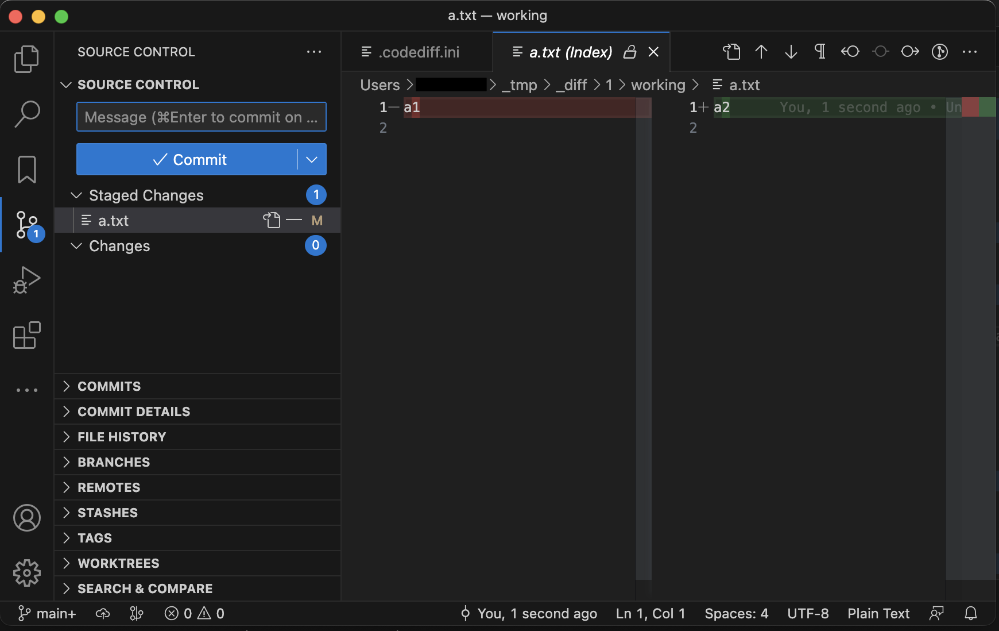

# codediff

フォルダーまたは Git リポジトリの差分を
Git のコミットの差分として Visual Studio Code で表示します。

## コマンドのサンプル

### ~/_tmp/_diff/1 フォルダーが無い場合

    codediff

- ~/_tmp/_diff/1 に Git ワーキング フォルダー を作ります
- 設定ファイル .codediff.ini が作られます
- Visual Studio Code が開きます
- 設定ファイル .codediff.ini を編集します

### ~/_tmp/_diff/1 フォルダーがある場合

    codediff

- `~/_tmp/_diff/1/.codediff.ini` ファイルを読み取ります
- ローカルに `.git` フォルダーを作り、差分のコミットを作ります
- Visual Studio Code が開きます
- Source Control ビューに切り替えて、差分を確認してください

### codediff コマンドに設定ファイルのパスを指定した場合

    codediff  codediff.ini

- 設定ファイルを `~/_tmp/_diff/1` にコピーして読み取ります。
    このとき、LocalPath パラメーターは フル パス に置き換わります
- ローカルに `.git` フォルダーを作り、差分のコミットを作ります
- Visual Studio Code が開きます
- Source Control ビューに切り替えて、差分を確認してください

## 設定ファイル

サンプル：

    # codediff command setting file

    [New]
    LocalPath = /home/user1/project1
    DeleteRelativePath = _base

    [Old]
    RepositoryURL = https://github.com/Takakiriy/example1
    BranchOrTag = develop

下記の書式の設定を 2つ並べます。

ローカルの他のフォルダーからコピーする場合：

    [__CommitMessage__]
    LocalPath = ____
    DeleteRelativePath = ____
    DeleteRelativePath = ____
        ...
    
Git リポジトリ からダウンロードする場合：

    [__CommitMessage__]
    RepositoryURL = ____
    BranchOrTag = ____
    BaseRelativePath = ____
    DeleteRelativePath = ____
    DeleteRelativePath = ____
        ...

`DeleteRelativePath` は全てのセクションに書く必要はありません。

設定を YAML などの一部に埋め込む場合、`#codediff` タグ を書き、
そのタグの次の行のインデントより浅くなるまでが codediff の設定になります。

    This is a YAML file:

    diff: |  #codediff:
        [New]
        LocalPath = /home/user1/project1
        DeleteRelativePath = _base

        [Old]
        RepositoryURL = https://github.com/Takakiriy/example1
        BranchOrTag = develop
    This is out of codediff settings:

## テスト

    cd  test
    ./test_codediff.sh
    ./test_codediff.sh --manual-test
