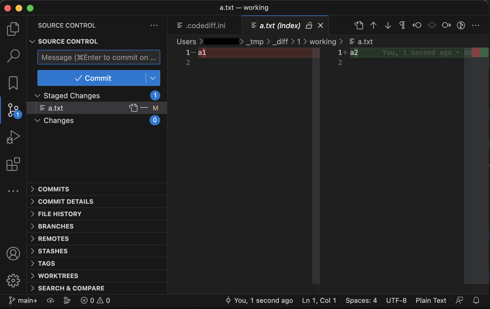

# codediff for Visual Studio Code

codediff は2つのフォルダーの差分を分かりやすく
Visual Studio Code に表示するCLIコマンドです。
Git リポジトリのURLや、差分の設定ファイルを指定することもできます。

無料の比較ソフトがない mac でも使えます。

## 比較コマンド

### codediff コマンドに比較対象を指定する場合

    codediff  path/to/old/folder  path/to/new/folder

または

    codediff  https://URL1#branch1  https://URL2#branch2

パスと URL を指定して比較することもできます。

- `~/_tmp/_diff/1/.codediff.ini` に設定ファイルが作られます
- `~/_tmp/_diff/1/working` に `.git` フォルダーを作り、差分のコミットを作ります
- Visual Studio Code が開きます
- Source Control ビューに切り替えて、差分を確認してください

Windows Git bash または PowerShell でフルパスを指定する場合は、`/c/` から始めてください。

### codediff コマンドに設定ファイルのパスを指定した場合

    codediff  codediff.ini

または

    codediff  codediff.yaml

- 設定ファイルを `~/_tmp/_diff/1/.codediff.ini` にコピーして読み取ります。
    コピーした先のファイルの `LocalPath` パラメーターは フル パス に置き換わります。
- `~/_tmp/_diff/1/working` に `.git` フォルダーを作り、差分のコミットを作ります
- Visual Studio Code が開きます
- Source Control ビューに切り替えて、差分を確認してください

Windows Git bash または PowerShell でフルパスを指定する場合は、`/c/` から始めてください。

設定を YAML などの一部に埋め込む場合、`#codediff` タグ を書き、
そのタグの次の行のインデントより浅くなる行の前までが codediff の設定になります。

    This is a YAML file:

    diff: |  #codediff:
        [Old]
        LocalPath = _base
        [New]
        LocalPath = .
        ExcludeRelativePath = _base
    This is out of codediff settings:

### コマンドのパラメーターなしで、`~/_tmp/_diff/1/.codediff.ini` ファイルが無い場合

    codediff

- `~/_tmp/_diff/1/.codediff.ini` に設定ファイルが作られます。
    作られるファイルは、`codediff` コマンドと同じフォルダーにある
    `codediff_template.ini` ファイルのコピーです
- Visual Studio Code が開きます
- 比較はまだ行われません
- 設定ファイル `.codediff.ini` を編集して、もう一度 `codediff` を実行してください（下記）

### コマンドのパラメーターなしで、`~/_tmp/_diff/1/.codediff.ini` ファイルがある場合

    codediff

- `~/_tmp/_diff/1/.codediff.ini` ファイルを読み取ります
- `~/_tmp/_diff/1/working` に`.git` フォルダーを作り、差分のコミットを作ります
- Visual Studio Code が開きます
- Source Control ビューに切り替えて、差分を確認してください

## 比較用設定ファイル

サンプル：

    # codediff command setting file

    [Old]
    RepositoryURL = https://github.com/Takakiriy/example1
    BranchOrTag = develop

    [New]
    LocalPath = /home/user1/project1
    ExcludeRelativePath = _base

下記の書式の設定を 2つ並べます。
新旧2つのフォルダーやファイルを比較する場合、1つ目が古いもの、2つ目が新しいものを指定します。

ローカルの他のフォルダーからコピーする場合：

    [__CommitMessage__]
    LocalPath = ____
    ExcludeRelativePath = ____
    ExcludeRelativePath = ____
        ...

Git リポジトリ からダウンロードする場合：

    [__CommitMessage__]
    RepositoryURL = ____
    BranchOrTag = ____
    BaseRelativePath = ____
    ExcludeRelativePath = ____
    ExcludeRelativePath = ____
        ...

`LocalPath` の基準パスは、設定ファイルがあるフォルダーです。

`ExcludeRelativePath` は全てのセクションに書く必要はありません。

## コンフリクト チェック

ブランチ間でコンフリクトしていないかをチェックします。

    codediff  path/to/git/working/folder  --merge "branch_1, branch_2"  --check

または

    codediff  https://github.com/owner/URL/  --merge "branch_1, branch_2, branch_3"

- --check オプションをつける場合、コンフリクトしているかいないかの表示だけをします
- --check オプションをつけない場合、マージの途中でコンフリクトした状態を Visual Studio Code で開きます
- コンフリクトが発生しなければ、終了コードは 0 になります

## テスト

### コマンド

    test/test_codediff.sh
    test/test_codediff.sh --manual-test

### WSL2 の中でテストを起動するコマンド

WSL2 をインストールして実行すると安定します。

Windows git bash から

    cd  test
    wsl ./test_codediff.sh
    wsl ./test_codediff.sh --manual-test

### 翻訳の同期が取れたら

translated Git タグを更新します。

