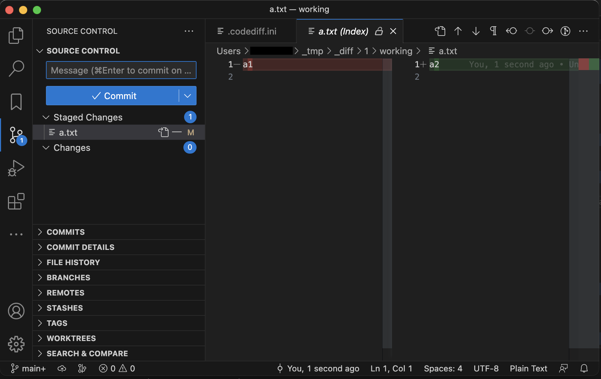

# codediff for Visual Studio Code

codediff is a CLI command that displays difference
between two folders in Visual Studio Code
in easy-to-understand manner.
You can also specify Git repository URL or a diff configuration file.

You can also be used on mac without free comparison software.

([Japanese](./README-jp.md))

## Command Example

### If specifying a comparison target for the codediff command

    codediff  path/to/old/folder  path/to/new/folder

or

    codediff  https://URL1#branch1  https://URL2#branch2

You can also specify paths and URL to compare.

- Create a setting file at `~/_tmp/_diff/1/.codediff.ini`
- `.git` folder is created in `~/_tmp/_diff/1/working` and Git commit difference is created
- Visual Studio Code is opened
- Please change to Source Control view and show difference

### If there is not command parameterｓ and there is not `~/_tmp/_diff/1/.codediff.ini` file

    codediff

- Create a setting file at `~/_tmp/_diff/1/.codediff.ini`.
    Created file is a copy of `codediff_template.ini` file
    that there is in `codediff` command folder
- Visual Studio Code is opened
- To compare is not done, yet
- Please, edit the setting file `.codediff.ini` and run `codediff` again (below described)

### If there is not command parameterｓ and there not `~/_tmp/_diff/1/.codediff.ini` file

    codediff

- Read `~/_tmp/_diff/1/.codediff.ini` file
- `.git` folder is created in `~/_tmp/_diff/1/working` and Git commit difference is created
- Visual Studio Code is opened
- Please change to Source Control view and show difference

### If codediff command has a setting file path parameter

    codediff  codediff.ini

- Copy the specified setting file to `~/_tmp/_diff/1/.codediff.ini` and read it.
    `LocalPath` parameter in the destination file will be replaced to
    the full path.
- `.git` folder is created in `~/_tmp/_diff/1/working` and Git commit difference is created
- Visual Studio Code is opened
- Please change to Source Control view and show difference

## Setting file

Example:

    # codediff command setting file

    [Old]
    RepositoryURL = https://github.com/Takakiriy/example1
    BranchOrTag = develop

    [New]
    LocalPath = /home/user1/project1
    ExcludeRelativePath = _base

Write 2 sections as the following format setting.
When comparing old and new folders or files,
specify the old one as the first and the new one as the second.

Case of copy from local other folder:

    [__CommitMessage__]
    LocalPath = ____
    ExcludeRelativePath = ____
    ExcludeRelativePath = ____
        ...

Case of downloading from Git repository:

    [__CommitMessage__]
    RepositoryURL = ____
    BranchOrTag = ____
    BaseRelativePath = ____
    ExcludeRelativePath = ____
    ExcludeRelativePath = ____
        ...

The base path for `LocalPath` is the folder where the setting file are located.

It is not necessary to write `ExcludeRelativePath` in all sections.

If you embed the settings in a part such as YAML,
write a `#codediff` tag and codediff settings.
The settings are until it becomes shallower than
the depth of the line following the tag.

    This is a YAML file:

    diff: |  #codediff:
        [Old]
        LocalPath = _base
        [New]
        LocalPath = .
        ExcludeRelativePath = _base
    This is out of codediff settings:

## Test

    cd  test
    ./test_codediff.sh
    ./test_codediff.sh --manual-test
